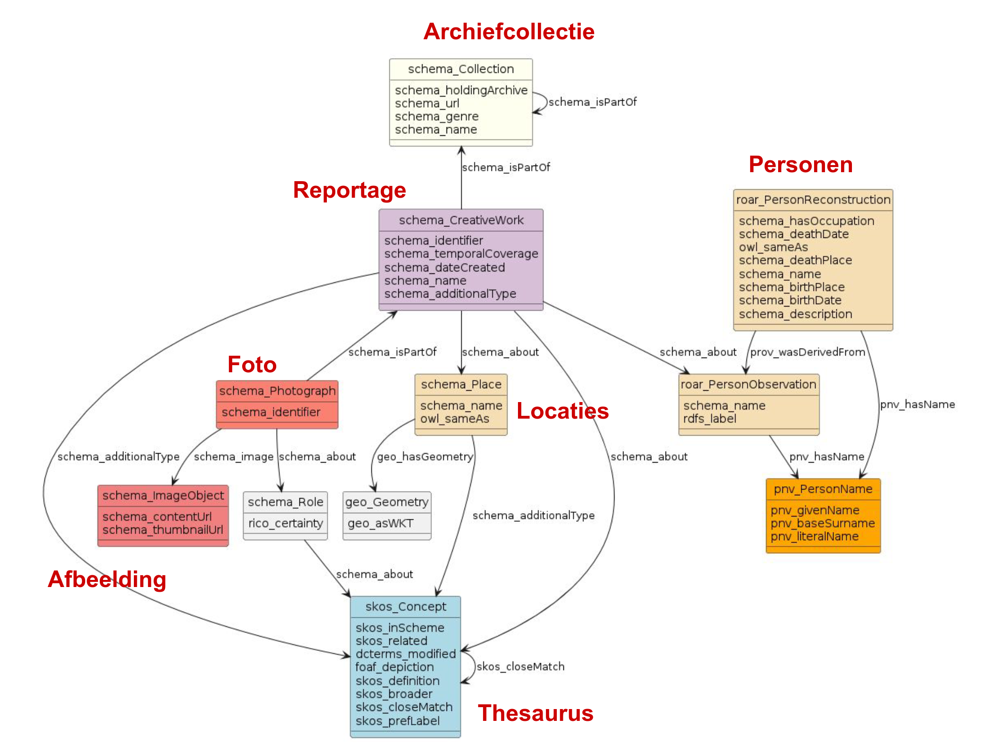

# FAIR Photos - CLARIAH FAIR Data Call 2023

[](https://doi.org/10.17026/SS/7VD3ME)

The collection of Fotopersbureau De Boer is particularly notable for its abundance of subjects and size (2 million photos). It contains valuable material for research on current topics such as environment, energy, and social inequality, and provides a glimpse into the everyday lives of people. 

The 'FAIR Photos' project has enriched the metadata of the collection by linking them to thesauri of locations, persons, and keywords in order to further open up the collection for use in research and the cultural heritage sector. This newly added information is reintegrated into the archive's collection management system to ensure long-term storage sustainability. This data deposition contains the enriched metadata in both CSV and RDF formats.

For more information:
- Noord-Hollands Archief: https://noord-hollandsarchief.nl/
- Fotopersbureau De Boer: https://noord-hollandsarchief.nl/collecties/beeld/collectie-fotopersbureau-de-boer/
- CLARIAH FAIR Data Call 2023: https://www.clariah.nl/clariah-fair-data-call-2023

## Model

The data model is based on the schema.org vocabulary (https://schema.org). The model is further extended with the PNV vocabulary (https://w3id.org/pnv) for person names and the ROAR vocabulary (https://w3id.org/roar) for person observations and reconstructions.



## Data
The data are available in CSV and RDF Turtle format. Due to their abundance, the HisVis AI tags are only available in the RDF. Please note that at the moment of deposit, the URIs prefixed with https://data.noord-hollandsarchief.nl/ are not resolving and it is unclear if this will be made possible in the future. The UUIDs are however stable and should be able to be used to retrieve the resources in the future. 

Almost all resources are modelled in the schema.org vocabulary (https://schema.org), with exception of person observations and reconstructions (cf. `roar` vocabulary, https://w3id.org/roar), and person names (cf. `pnv` vocabulary, https://w3id.org/pnv). To indicate the certainty of an AI tag, the `rico:certainty` property from the `rico` ontology (https://www.ica.org/standards/RiC/ontology) is used. 

Where the schema.org vocabulary is not specific enough, other vocabularies are used to attribute a concept from the AAT (https://www.getty.edu/research/tools/vocabularies/aat/) or GTAA (https://www.beeldengeluid.nl/kennis/kennisthemas/metadata/gemeenschappelijke-thesaurus-audiovisuele-archieven) is attributed using the `schema.org/additionalType` property. More info on the reconciliation process can be found in the README in the concepts folder. 

Only person data (observation and reconstruction) from 'public persons' are included. It may lead to URIs in the report data (via a `schema:about` property) that do not carry any other information. These can be filled in later (once the person is set to 'public', e.g. through disambiguation).

See the example below for an example of the RDF description of a single photograph and related resources.

### CSV
The CSV files are generated from the RDF with the SPARQL queries in the `queries` folder.

1. `photographs.csv` - Each line is an individual photograph with its attributes and relations to other entities (e.g. reports, persons, locations) through one or more uuids. Information is given on:
   
    - The permalink of the photogrpah (the HANDLE given by the Noord-Hollands Archief)
    - Its identifier
    - A URL to a thumbnail (cf. IIIF Image API)
    - UUID of the report the photo is part of
    - Name of the report the photo is part of
    - Date of the report the photo is part of
    - Any person observations made in this report. UUID and name are included in separate columns. Multiple entries are separated by a semicolon and a space (`; `).
    - Any locations mentioned in this report. UUID and name are included in separate columns. Multiple entries are separated by a semicolon and a space (`; `).
    - Any concepts that classify this report. URI and name are included in separate columns. Multiple entries are separated by a semicolon and a space (`; `).

2. `personobservations.csv` - Each line is an individual person observation with its attributes. For name attributes, the property names from the PNV vocabulary (https://w3id.org/pnv) are used. Only information on 'public persons' is included. Information is given on:

    - UUID of the person observation
    - Label of the person observation entry (e.g. "Jansen, Jan")
    - Name of the person observation entry (e.g. "Jan Jansen")
    - Prefix of the person's name
    - Initials of the person's name
    - Given name of the person's name
    - Infix title of the person's name
    - Surname prefix of the person's name
    - Base surname of the person's name
    - Patronym of the person's name
    - Disambiguating description of the person's name
  
3. `personreconstructions.csv` - Each line is an individual person reconstruction with its attributes. For name attributes, the property names from the PNV vocabulary (https://w3id.org/pnv) are used. Only information on 'public persons' is included. Information is given on:

    - UUID of the person reconstruction
    - Name of the person reconstruction entry (e.g. "Jan Jansen")
    - Prefix of the person's name
    - Initials of the person's name
    - Given name of the person's name
    - Infix title of the person's name
    - Surname prefix of the person's name
    - Base surname of the person's name
    - Patronym of the person's name
    - Disambiguating description of the person's name
    - UUID(s) and names of the person observation(s) that lead to this reconstruction. Multiple entries are separated by a semicolon and a space (`; `).
    - A URI to the Wikidata entry of the person
    - A URI to the GTAA entry of the person

4. `locations.csv` - Each line is an individual location with its attributes. Information is given on:

    - UUID of the location
    - Name of the location
    - The location type (URI and label), as defined by the AAT
    - The location geometry in WKT format
    - A URI to the Wikidata entry of the location
    - A URI to the GTAA entry of the location

5. `concepts.csv` - Each line is an individual subject card concept with its attributes. Information is given on:

    - URI of the concept
    - Preferred label of the concept in Dutch and English (if available)
    - Alternative labels of the concept in Dutch and English (if available)
    - URI and preferred label in Dutch and English of the broader concept
    - Any related concepts (URI). Multiple entries are separated by a semicolon and a space (`; `).
    - Any close matches (URI). For instance a concept from the HisVis AI tags concept scheme. Multiple entries are separated by a semicolon and a space (`; `).
    - Any exact matches (URI). Multiple entries are separated by a semicolon and a space (`; `).

6. `tags.csv` - Each line is an individual HisVis AI tag concept with its attributes. Information is given on:

    - URI of the concept
    - Preferred label of the concept in Dutch and English (if available)
    - Alternative labels of the concept in Dutch and English (if available)
    - URI and preferred label in Dutch and English of the broader concept
    - Any related concepts (URI). Multiple entries are separated by a semicolon and a space (`; `).
    - Any close matches (URI). For instance a concept from the subject card concept scheme. Multiple entries are separated by a semicolon and a space (`; `).
    - Any exact matches (URI). Multiple entries are separated by a semicolon and a space (`; `).
    - Definitions of the concept in Dutch and English (if available)

### RDF

An example of the description of a photograph ([`https://hdl.handle.net/21.12102/a55d7380-e5b6-aaee-94ae-8f03096b77a4`](https://hdl.handle.net/21.12102/a55d7380-e5b6-aaee-94ae-8f03096b77a4)) is given below:

```turtle
@prefix aat: <http://vocab.getty.edu/aat/> .
@prefix dcterms: <http://purl.org/dc/terms/> .
@prefix foaf: <http://xmlns.com/foaf/0.1/> .
@prefix geo: <http://www.opengis.net/ont/geosparql#> .
@prefix gtaa: <http://data.beeldengeluid.nl/gtaa/> .
@prefix owl: <http://www.w3.org/2002/07/owl#> .
@prefix pnv: <https://w3id.org/pnv#> .
@prefix prov: <http://www.w3.org/ns/prov#> .
@prefix rdfs: <http://www.w3.org/2000/01/rdf-schema#> .
@prefix rico: <https://www.ica.org/standards/RiC/ontology#> .
@prefix roar: <https://w3id.org/roar#> .
@prefix schema: <https://schema.org/> .
@prefix skos: <http://www.w3.org/2004/02/skos/core#> .
@prefix wd: <http://www.wikidata.org/entity/> .
@prefix xsd: <http://www.w3.org/2001/XMLSchema#> .

<https://hdl.handle.net/21.12102/a55d7380-e5b6-aaee-94ae-8f03096b77a4> a schema:Photograph ;
    schema:about [ a schema:Role ;
            schema:about <https://digitaalerfgoed.poolparty.biz/nha/a2c47bdc-ae1f-8dd4-8e2d-3df8a28a03c6> ;
            rico:certainty "0.45"^^xsd:float ],
        [ a schema:Role ;
            schema:about <https://digitaalerfgoed.poolparty.biz/nha/f0881540-bb3e-3755-dbac-735be0b40890> ;
            rico:certainty "1.0"^^xsd:float ],
        [ a schema:Role ;
            schema:about <https://digitaalerfgoed.poolparty.biz/nha/c7d7de0a-1aad-64b8-4208-0d188cacef9d> ;
            rico:certainty "0.4"^^xsd:float ] ;
    schema:identifier "NL-HlmNHA_1478_13925B00_01" ;
    schema:image <https://maior-images.memorix.nl/ranh/iiif/9bc8e0c5-b530-2354-a20a-92ea12cf2f85> ;
    schema:isPartOf <https://data.noord-hollandsarchief.nl/collection/FotopersbureauDeBoer/report/c9a72d42-5843-b781-264c-632a381f9a1f> .

<https://maior-images.memorix.nl/ranh/iiif/9bc8e0c5-b530-2354-a20a-92ea12cf2f85> a schema:ImageObject ;
    schema:contentUrl <https://maior-images.memorix.nl/ranh/iiif/9bc8e0c5-b530-2354-a20a-92ea12cf2f85/full/max/0/default.jpg> ;
    schema:thumbnailUrl <https://maior-images.memorix.nl/ranh/iiif/9bc8e0c5-b530-2354-a20a-92ea12cf2f85/full/,250/0/default.jpg> .

<https://data.noord-hollandsarchief.nl/collection/FotopersbureauDeBoer/report/c9a72d42-5843-b781-264c-632a381f9a1f> a schema:CreativeWork ;
    schema:about <https://data.noord-hollandsarchief.nl/collection/FotopersbureauDeBoer/location/0d7a7fe6-acd6-594b-b552-27e28fb46db1>,
        <https://data.noord-hollandsarchief.nl/collection/FotopersbureauDeBoer/person/observation/fa906ea0-8d10-11ee-9aac-ac1f6ba5b082>,
        <https://digitaalerfgoed.poolparty.biz/nha/a9208ebc-d5f7-3fe6-14c1-05a880ba0690>,
        <https://digitaalerfgoed.poolparty.biz/nha/acd4a20a-ec61-bc6e-01f0-412a54c37524> ;
    schema:additionalType gtaa:30294 ;
    schema:dateCreated "1957-03-11"^^xsd:date ;
    schema:identifier "18948" ;
    schema:isPartOf <https://data.noord-hollandsarchief.nl/collection/FotopersbureauDeBoer/serie/vlakfilms> ;
    schema:name "Romanschrijver Harry Mulisch op het dak van de Sint-Bavokerk in Haarlem" .

<https://data.noord-hollandsarchief.nl/collection/FotopersbureauDeBoer/serie/vlakfilms> a schema:ArchiveComponent,
        schema:Collection ;
    schema:genre aat:300127350 ;
    schema:isPartOf <https://data.noord-hollandsarchief.nl/collection/FotopersbureauDeBoer/> ;
    schema:name "Vlakfilms"@nl .

<https://data.noord-hollandsarchief.nl/collection/FotopersbureauDeBoer/> a schema:ArchiveComponent,
        schema:Collection ;
    schema:holdingArchive <https://ror.org/03fsb6681> ;
    schema:name "Collectie Fotopersbureau De Boer" ;
    schema:url <https://noord-hollandsarchief.nl/collecties/beeld/collectie-fotopersbureau-de-boer> .

<https://data.noord-hollandsarchief.nl/collection/FotopersbureauDeBoer/person/observation/fa906ea0-8d10-11ee-9aac-ac1f6ba5b082> a roar:PersonObservation ;
    rdfs:label "Mulisch, Harry" ;
    schema:name "Harry Mulisch" ;
    pnv:hasName [ a pnv:PersonName ;
            pnv:baseSurname "Mulisch" ;
            pnv:givenName "Harry" ;
            pnv:literalName "Harry Mulisch" ] .

<https://data.noord-hollandsarchief.nl/collection/FotopersbureauDeBoer/person/reconstruction/67688614-5a70-5835-87a5-67b63ee56ee6> a schema:Person,
        roar:PersonReconstruction ;
    owl:sameAs gtaa:134822,
        wd:Q927 ;
    prov:wasDerivedFrom <https://data.noord-hollandsarchief.nl/collection/FotopersbureauDeBoer/person/observation/fa906ea0-8d10-11ee-9aac-ac1f6ba5b082> ;
    schema:birthDate "1927-07-29"^^xsd:date ;
    schema:birthPlace "Haarlem" ;
    schema:deathDate "2010-10-30"^^xsd:date ;
    schema:deathPlace "Amsterdam" ;
    schema:description "Nederlands schrijver (1927–2010)" ;
    schema:hasOccupation "dichter",
        "essayist",
        "romanschrijver",
        "scenarioschrijver",
        "schrijver",
        "toneelschrijver" ;
    schema:name "Harry Mulisch" ;
    pnv:hasName [ a pnv:PersonName ;
            pnv:baseSurname "Mulisch" ;
            pnv:givenName "Harry" ;
            pnv:literalName "Harry Mulisch" ] .

<https://data.noord-hollandsarchief.nl/collection/FotopersbureauDeBoer/location/0d7a7fe6-acd6-594b-b552-27e28fb46db1> a schema:Place ;
    geo:hasGeometry [ a geo:Geometry ;
            geo:asWKT "POINT(4.6359055555556 52.381366666667)"^^geo:wktLiteral ] ;
    owl:sameAs wd:Q1083850 ;
    schema:additionalType aat:300008247 ;
    schema:name "Grote Markt" .

<https://digitaalerfgoed.poolparty.biz/nha/acd4a20a-ec61-bc6e-01f0-412a54c37524> a skos:Concept ;
    dcterms:modified "2023-07-19T15:05:19.659000+00:00"^^xsd:dateTime ;
    skos:broader <https://digitaalerfgoed.poolparty.biz/nha/2c502f9c-9b95-4d4e-c65c-2a1827b2c1e7> ;
    skos:closeMatch aat:300025492 ;
    skos:inScheme <https://digitaalerfgoed.poolparty.biz/nha/01617d03-bcd9-4720-9392-bf6bd92227b9> ;
    skos:prefLabel "Personen schrijven"@nl .

<https://data.noord-hollandsarchief.nl/collection/FotopersbureauDeBoer/catalog/acd4a20a-ec61-bc6e-01f0-412a54c37524> a schema:CreativeWork ;
    schema:about <https://digitaalerfgoed.poolparty.biz/nha/acd4a20a-ec61-bc6e-01f0-412a54c37524> ;
    schema:additionalType aat:300026769 ;
    schema:name "Personen schrijven" ;
    schema:temporalCoverage "1975/1990" .

<https://digitaalerfgoed.poolparty.biz/nha/c7d7de0a-1aad-64b8-4208-0d188cacef9d> a skos:Concept ;
    dcterms:modified "2023-12-20T10:57:31.478000+00:00"^^xsd:dateTime ;
    skos:broader <https://digitaalerfgoed.poolparty.biz/nha/9571146c-71de-7477-b892-3c6f0dba1d7e> ;
    skos:closeMatch gtaa:28026,
        aat:300007466,
        <https://digitaalerfgoed.poolparty.biz/nha/a36695da-4357-f335-92aa-11f0cacdfe86> ;
    skos:definition "a picture taken of the outside of a church"@en,
        "Buitenkant van een kerk"@nl ;
    skos:inScheme <https://digitaalerfgoed.poolparty.biz/nha/7325bb27-69b0-4c36-9f0c-914ba5d49faf> ;
    skos:prefLabel "Church outdoor"@en,
        "Kerk buiten"@nl ;
    foaf:depiction <https://images.memorix.nl/ranh/thumb/500x500/ecf29275-9946-ea04-987c-13016fb37a15.jpg> .

<https://digitaalerfgoed.poolparty.biz/nha/f0881540-bb3e-3755-dbac-735be0b40890> a skos:Concept ;
    dcterms:modified "2023-12-20T10:32:30.531000+00:00"^^xsd:dateTime ;
    skos:broader <https://digitaalerfgoed.poolparty.biz/nha/fa9afba5-b396-4cc8-86d3-aaaba7e1fa11> ;
    skos:definition "Foto's die in de open lucht zijn genomen"@nl ;
    skos:inScheme <https://digitaalerfgoed.poolparty.biz/nha/7325bb27-69b0-4c36-9f0c-914ba5d49faf> ;
    skos:prefLabel "Buiten"@nl ;
    skos:related <https://digitaalerfgoed.poolparty.biz/nha/7dbc6a7e-4258-2434-bc3d-567164764912> ;
    foaf:depiction <https://images.memorix.nl/ranh/thumb/500x500/30bbbc7d-be28-a9df-e9f2-9e0f42a64309.jpg> .

<https://digitaalerfgoed.poolparty.biz/nha/a2c47bdc-ae1f-8dd4-8e2d-3df8a28a03c6> a skos:Concept ;
    dcterms:modified "2023-12-20T10:57:21.860000+00:00"^^xsd:dateTime ;
    skos:broader <https://digitaalerfgoed.poolparty.biz/nha/fd603119-f48c-43da-b084-fcc20598f8f5> ;
    skos:closeMatch gtaa:27140,
        aat:300015637,
        <https://digitaalerfgoed.poolparty.biz/nha/a9208ebc-d5f7-3fe6-14c1-05a880ba0690> ;
    skos:definition "portrait of one or two people posing"@en,
        "Portret van één of twee mensen die poseren voor de foto"@nl ;
    skos:inScheme <https://digitaalerfgoed.poolparty.biz/nha/7325bb27-69b0-4c36-9f0c-914ba5d49faf> ;
    skos:prefLabel "Portrait"@en,
        "Portret"@nl ;
    foaf:depiction <https://images.memorix.nl/ranh/thumb/500x500/03b2a186-ed91-3ab2-97be-70578c2bddef.jpg> .

<https://digitaalerfgoed.poolparty.biz/nha/a9208ebc-d5f7-3fe6-14c1-05a880ba0690> a skos:Concept ;
    dcterms:modified "2023-12-20T10:57:21.863000+00:00"^^xsd:dateTime ;
    skos:broader <https://digitaalerfgoed.poolparty.biz/nha/11c0b2f4-0a96-11ee-be56-0242ac120002> ;
    skos:closeMatch gtaa:27140,
        aat:300015637,
        <https://digitaalerfgoed.poolparty.biz/nha/a2c47bdc-ae1f-8dd4-8e2d-3df8a28a03c6> ;
    skos:inScheme <https://digitaalerfgoed.poolparty.biz/nha/01617d03-bcd9-4720-9392-bf6bd92227b9> ;
    skos:prefLabel "Portretten"@nl .

<https://data.noord-hollandsarchief.nl/collection/FotopersbureauDeBoer/catalog/a9208ebc-d5f7-3fe6-14c1-05a880ba0690> a schema:CreativeWork ;
    schema:about <https://digitaalerfgoed.poolparty.biz/nha/a9208ebc-d5f7-3fe6-14c1-05a880ba0690> ;
    schema:additionalType aat:300026769 ;
    schema:name "Portretten" ;
    schema:temporalCoverage "1947/1989" .

aat:300008247 a skos:Concept ;
    skos:prefLabel "Straat" .

aat:300026769 a skos:Concept ;
    skos:prefLabel "Cataloguskaart"@nl .
```

